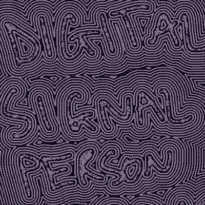

Check out my art portfolio: www.digitalsignalperson.com

WIP wasm demos (using [sokol](https://github.com/floooh/sokol), [miniaudio](https://github.com/mackron/miniaudio), [imgui](https://github.com/ocornut/imgui)):
- [zero-text-sapp](https://digitalsignalperson.github.io/demos/zero-text-sapp.html) a fork/rewrite of ImGuiColorTextEdit focusing on WYSIWYG markdown
- [zero-stft-sapp](https://digitalsignalperson.github.io/demos/zero-stft-sapp.html) live STFT visual based on 128 tone-spaced FFT channels with wavelet-like scaling
- [zero-primitive-sapp](https://digitalsignalperson.github.io/demos/zero-primitive-sapp.html) similar controls to the stft-app but with a pre-baked animation
- [zero-audio-sapp](https://digitalsignalperson.github.io/demos/zero-audio-sapp.html) DJ deck with a creative set of tempo controls (x2, /2, +/-2 semi, +/-1 semi, +/- 20%, 0-200%, +/-200%, +/- 1000%)
    - includes sokol event hacking to simulate multitouch: [Demo video](https://github.com/ocornut/imgui/issues/7322#issuecomment-2128813405)

# Repository Index
## with PRs
- **[brotab](https://github.com/digitalsignalperson/brotab)** (${\color{#3572A5}⬤}$ Python)
    - (✅ Merged) [#108: New features: screenshot, open URLs in new window, query for +windowFocused](https://github.com/balta2ar/brotab/pull/108)
- **[dodo](https://github.com/digitalsignalperson/dodo)** (${\color{#3572A5}⬤}$ Python)
    - (📝 Draft) [#30: Allow for tags with whitespaces and special characters](https://github.com/akissinger/dodo/pull/30)
    - (📝 Draft) [#31: Feature to increasingly narrow tags in tag view](https://github.com/akissinger/dodo/pull/31)
- **[FreeRDP](https://github.com/digitalsignalperson/FreeRDP)** (${\color{#555555}⬤}$ C)
    - (✅ Merged) [#9080: Implement pen functionality for X11](https://github.com/FreeRDP/FreeRDP/pull/9080)
    - (✅ Merged) [#9081: small fixes to #9080](https://github.com/FreeRDP/FreeRDP/pull/9081)
- **[lieer](https://github.com/digitalsignalperson/lieer)** (${\color{#3572A5}⬤}$ Python)
    - (✅ Merged) [#245: add -v --verbose option for push & pull](https://github.com/gauteh/lieer/pull/245)
    - (✅ Merged) [#247: github action for black formatter and running black on the repo](https://github.com/gauteh/lieer/pull/247)
- **[miniaudio](https://github.com/digitalsignalperson/miniaudio)** (${\color{#555555}⬤}$ C)
    - (📝 Draft) [#852: jack: add noAutoConnect option and allow arbitrary number of channels](https://github.com/mackron/miniaudio/pull/852)
- **[obsidian-releases](https://github.com/digitalsignalperson/obsidian-releases)** (${\color{#f1e05a}⬤}$ JavaScript)
    - (✅ Merged) [#1685: add digitalsignalperson/obsidian-rofi-helper](https://github.com/obsidianmd/obsidian-releases/pull/1685)
- **[youtube-dl](https://github.com/digitalsignalperson/youtube-dl)** (${\color{#3572A5}⬤}$ Python)
    - (❌ Closed) [#27247: Replace all os.remove & os.rename combos with single os.replace (Fix deletion of post-processed videos)](https://github.com/ytdl-org/youtube-dl/pull/27247)
- **[zfs](https://github.com/digitalsignalperson/zfs)** (${\color{#555555}⬤}$ C)
    - (📝 Draft) [#15821: Implement -f option to force inherit key with zfs change-key -if](https://github.com/openzfs/zfs/pull/15821)
- **[zfs_autobackup](https://github.com/digitalsignalperson/zfs_autobackup)** (${\color{#3572A5}⬤}$ Python)
    - (✅ Merged) [#146: Add --snapshot-property argument to pass to zfs snapshot](https://github.com/psy0rz/zfs_autobackup/pull/146)
## Owned
- **[comma-python](https://github.com/digitalsignalperson/comma-python)** (${\color{#3572A5}⬤}$ Python) (⭐ 4 stars) *A persistent Jupyter python kernel for your shell*
- **[configs](https://github.com/digitalsignalperson/configs)** (${\color{#89e051}⬤}$ Shell)
    - (Obsolete) This is how I would bootstrap my arch linux intalls 5 years ago.
    - Based on booting from an Ubuntu live USB (includes ZFS kernel module) and boostrapping arch linux from there
- **[obsidian-rofi-helper](https://github.com/digitalsignalperson/obsidian-rofi-helper)** (${\color{#3572A5}⬤}$ Python) (⭐ 17 stars) *This plugin adds a leaf id parameter to the URI protocol for switching between open Obsidian tabs with Rofi.*
## Forks
- **[gallery-dl_twitter-obsidian](https://github.com/digitalsignalperson/gallery-dl_twitter-obsidian)** (${\color{#3572A5}⬤}$ Python) *gallery-dl with some hacks to save all bookmarks and create an obsidian vault with them*
    - Reference: https://forum.obsidian.md/t/twitter-favorites-as-an-obsidian-brain-with-graphs-and-canvases/54342
- **[rofi-kwin-highlight](https://github.com/digitalsignalperson/rofi-kwin-highlight)** (${\color{#555555}⬤}$ C) *Enhancement for rofi's window mode for KDE Plasma: Send dbus commands for KWin to highlight windows when the selection changes*
- **[sokol-custom](https://github.com/digitalsignalperson/sokol-custom)** (${\color{#555555}⬤}$ C) *sokol with ability to define a custom implementation external to sokol_app.h (Wayland included)*
    - This fork is based off [@fleischie](https://github.com/fleischie)'s [PR #425](https://github.com/floooh/sokol/pull/425) to add Wayland support to `sokol_app.h`. See also [this branch](https://github.com/digitalsignalperson/sokol-custom/tree/wayland-pr-rebase) that rebased the PR before moving everything around.
- **[sokol-samples](https://github.com/digitalsignalperson/sokol-samples)** (${\color{#555555}⬤}$ C) *81d2964: imgui multitouch demo WIP*
    - Reference: [ocornut/imgui#7322 (comment)](https://github.com/ocornut/imgui/issues/7322#issuecomment-2128660457)
    - [Demo video](https://github.com/ocornut/imgui/issues/7322#issuecomment-2128813405)
## Gists
- **[layer-shell.c](https://gist.github.com/digitalsignalperson/9f6bc16ba1954c40cb61ca4babc8c419)** (${\color{#555555}⬤}$ C) using casilda with gtk4-layer-shell for drop-down terminal

    - [ghostty-org/ghostty#4624 (comment)](https://github.com/ghostty-org/ghostty/issues/4624#issuecomment-2606655971)
- **[obsidian-bookmarks.py](https://gist.github.com/digitalsignalperson/7d86bb1a57911a6ea817db98070f723f)** (${\color{#3572A5}⬤}$ Python) obsidian bookmarks to markdown

- **[userChrome.css](https://gist.github.com/digitalsignalperson/7e5d4a44fbd7427a2c11f5753b7920d7)** (${\color{#663399}⬤}$ CSS) denser firefox vertical tabs

- **[example.service](https://gist.github.com/digitalsignalperson/d1db4b41b369fdf74139d4eaa7f5fa34)** (${\color{#d1dbe0}⬤}$ INI) template for a systemd service that logs a failed invocation to /home/asdf/alerts/%N-failure

- **[zfs-extra-data-issues.md](https://gist.github.com/digitalsignalperson/709e2adf847473c5301d67644d4f4e19)** (${\color{#89e051}⬤}$ Shell) testing feasibility of zfs native encryption sync back and forth

    - [openzfs/zfs/discussions/15853](https://github.com/openzfs/zfs/discussions/15853)
    - [openzfs/zfs#12580 (comment)](https://github.com/openzfs/zfs/issues/12580#issuecomment-1928512058)
- **[incus-arch-zfs.sh](https://gist.github.com/digitalsignalperson/df10ea15752bdf63e319c9125a8a5b0a)** (${\color{#89e051}⬤}$ Shell) incus ZFS test VM for arch linux

- **[move_axes.py](https://gist.github.com/digitalsignalperson/546e80ae1965b83df0a82ba12ae8aac7)** (${\color{#3572A5}⬤}$ Python) Move a matplotlib Axes from one figure to another.

- **[bwrap-firefox.sh](https://gist.github.com/digitalsignalperson/dbaf5ecef5c50cb74417dafe515cf8bf)** (${\color{#89e051}⬤}$ Shell) (⭐ 1 stars) Bubblewrapped firefox with a fifo on the host to open links inside the container

- **[zfs-force-inherit-example.sh](https://gist.github.com/digitalsignalperson/f2b002e73d2f13e4a43d29a64b5f2a3e)** (${\color{#89e051}⬤}$ Shell) zfs force inherit encryptionroot on received dataset with pyzfs

    - [openzfs/zfs#15821 (pull request)](https://github.com/openzfs/zfs/pull/15821)
- **[tabs.css](https://gist.github.com/digitalsignalperson/56fe3cbcf41707cb97362234cb07ccb0)** (${\color{#663399}⬤}$ CSS) (⭐ 8 stars) obsidian tabs in multiple rows

    - "honestly a real life saver"
    -  Reference: https://forum.obsidian.md/t/tabs-in-multiple-rows/55964
- **[fish_merge.py](https://gist.github.com/digitalsignalperson/e6828c55748d2ddf214ffa75c57ea5fa)** (${\color{#3572A5}⬤}$ Python) Merge multiple fish history files together using flock (untested)

    - Reference: [fish-shell/fish-shell#120 (comment)](https://github.com/fish-shell/fish-shell/issues/120#issuecomment-1620813867)
- **[linux-rt-lts and zfs-dkms.sh](https://gist.github.com/digitalsignalperson/edcefe85992cfa23b75edd498eca5011)** (${\color{#89e051}⬤}$ Shell) example for how to install linux-rt-lts and zfs-dkms

    - "This is great"
- **[stream.sh](https://gist.github.com/digitalsignalperson/ef81c1afdc04d49f5ae3f6f97b2d29af)** (${\color{#89e051}⬤}$ Shell) (⭐ 12 stars) xdp screen cast example, modified to pipe to ffmpeg

- **[lxd-common](https://gist.github.com/digitalsignalperson/62b6f70094738dcdaaeedfc995599045)** (${\color{#89e051}⬤}$ Shell) (⭐ 1 stars) arch linux LXD stuff

- **[zfs-native-encryption-test.sh](https://gist.github.com/digitalsignalperson/0da0cd70ab8c64f32583976cd4bd180b)** (${\color{#89e051}⬤}$ Shell) zfs encryption speed test

- **[x-clickthrough.c](https://gist.github.com/digitalsignalperson/11183814a20f9491380285151d31588d)** (${\color{#555555}⬤}$ C) (⭐ 1 stars) Enable clickthrough, transparency, and always on top for a given window

- **[disable-trackpad-timeout.py](https://gist.github.com/digitalsignalperson/34c1df16fdcd4b87c873aaba29d70b22)** (${\color{#3572A5}⬤}$ Python) A script to auto-disable a trackpad N seconds after last press.

- **[touchosc-mixx-midi-mapping.py](https://gist.github.com/digitalsignalperson/3703ea6d60f719d415399857d5527a9f)** (${\color{#3572A5}⬤}$ Python) Mixxx midi output mappings generator for touchosc-dj (WIP)

